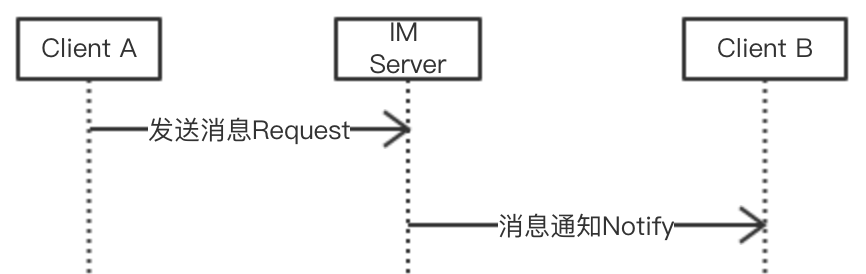
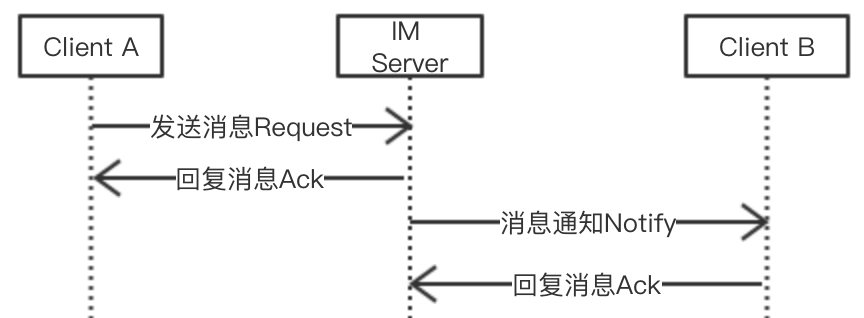

# 1 如何保证消息不丢失不重复
刚接手IM办公软件的时候，遇到的第一个问题就是IM办公软件会丢失消息。作为一款即时通讯软件，丢失消息是一个很致命的问题。怎么解决呢？先看一下最简单的消息发送流程。client A发送消息给IM服务器，IM服务器再转发消息给client B。

上述流程有个致命的问题，如果消息在发送过程中发生了丢失，既不知道消息有没有发生丢失，也不知道消息丢失发生在哪一个环节（是client A发送给IM服务器时候消息丢失还是IM服务器发送给client B时候发生消息丢失）。
如何确认消息有没有丢失，消息丢失发生在哪一个环节呢？可以通过应答机制来解决。client A发送消息给IM服务器，IM服务器收到消息后回复一个ack给client A, client A收到服务器发送的ack，client A就可以确定服务器收到了自己 发送的消息。如果没有收到服务器发送的ack，则不能确定服务器有没有收到自己发送的消息。这里存在两种可能，一种是client A发给服务器的时候，服务器没有收到消息；第二种是服务器收到消息了，发送ack给client A的后，client A没有收到ack。同理，服务器和Client B也是同样的流程，只是发送方成了IM 服务器，接收方成了client B。

加入应答机制后，可以确定消息成功接收的情形，client A发送消息给服务器且收到了服务器回复的ack。但对于消息丢失的情形怎么处理呢？借鉴TCP的超时重传机制，如果client A在一定时间内没有收到IM服务器回复的ack，则超时重传。对应流程如下：

但加入超时重传机制后，我们发现接收端会接收到重复消息，重复消息对于IM来说，体验相当不好。通过过滤重复消息可以避免收到重复消息，这里需要对于发送的每一条消息，生成一个唯一的message ID。对于message ID的生成有几种方案，一种是使用UUID, 一种是由服务器统一生成，还用一种是发送方标识加一个递增的数字。UUID使用简单，但仅适合于用户量较少的情况，如果用户量过大，依然会发生碰撞。服务器统一生成的话，可以保证消息的唯一性，但美中不足的是会多一次网络交互。发送方标识加递增数字的话，可以保证message ID唯一性，但需要在用户切换设备时候，同步递增数字。据网上资料显示，微信使用的第三种方式。
结合上面流程和机制，我们得到一个完整的流程。client A发送消息给IM服务器，IM服务器收到消息后，根据message ID过滤重复并回复ack给client A。 client A如果没有收到IM服务器发送的ack，则重新发送此消息，IM 服务器收到消息后重复上面流程（IM服务器收到消息后，根据message ID过滤重复并回复ack给client A）。同理, IM服务器和client B也是同样流程。

总结，保证消息不丢失不重复主要依赖于下述三个机制：
1.  应答机制，发送方发送消息，接收方收到消息后发送ack告诉发送方自己已收到消息。
2.  超时重传，发送方如果在一定时间内没有收到接收方发送的ack，则重新发送此消息。
3.  过滤重复，接收方在收到消息后，根据message ID过滤重复。
