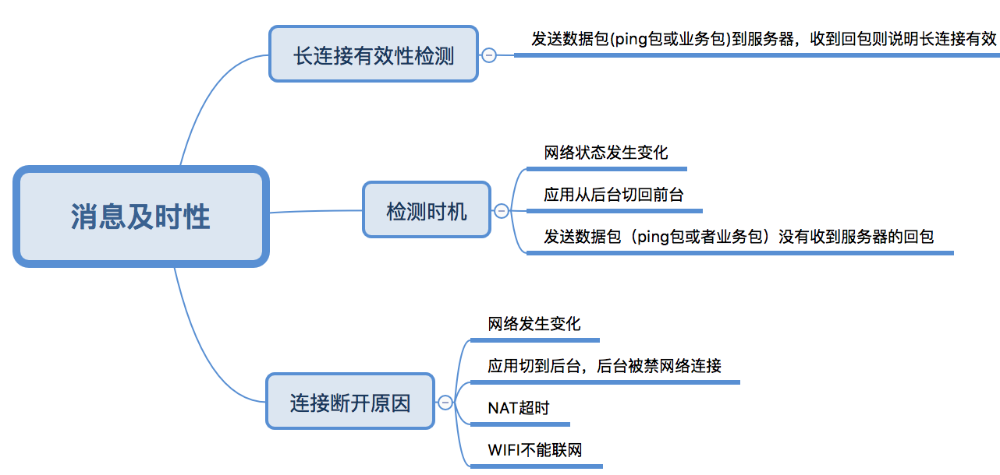

# 2 如何保证消息的及时性
在[如何保证消息不丢失不重复](im1.md)中提到了解决消息丢失和重复的方案，对于即时通讯软件来说，面临的第二个问题是如何保证消息的及时性。

IM开发中，发送方client A发送消息给服务器，直接建立一个新的网络连接发送即可。但对于接收方client B从服务器获取消息，由于服务器本身不知道client B的IP地址，不能直接建立一个新的连接发送消息给接收方client B，因此有两种方式可以使接收方client B从服务器获取消息：1.接收方不断轮询从服务器拉取（早期web IM使用此方式，但由于费电费流量并不适合于移动端）2.接收方和服务器维持一个长连接，通过心跳包保持长连接，服务器推送消息给接收端(移动端IM包括微信、QQ大多采用此方案)。

了解上述背景后，其实如何保证消息的及时性，就变成了如何保证长连接的有效性以及长连接断开后及时重连，即长连接断开时候可以及时知道，在网络状况变化时候，及时建立新的长连接。

如何判断长连接有效性呢？长连接是否有效，只有发送方发送数据包（业务包和心跳包）给IM服务器，并收到IM服务器的回包，才能确定长连接是有效的。

在移动客户端，长连接断开的原因有多种，最常见的有NAT超时、网络从WIFI切换到移动数据或者网络从移动数据切换到WIFI、应用切换到后台不能上网（IOS和部分Android手机）、WIFI需要认证、应用长连接进程被杀死、偶尔因客户端或者服务端心跳包发送失败导致NAT超时等原因。对于NAT超时，需要客户端定期（定期间隔时间小于NAT超时时间）来发送心跳包来避免NAT超时，保证长连接可用。

如何及时建立长连接呢？结合上述原因，需在下面几种时机去通过发送心跳包去检测长连接的有效性，如果长连接断开，则重新建立新的长连接。
1.  网络状态发生变化（从WIFI切换到移动网络或从移动网络切换到WIFI）
2.  应用从后台切换回前台
3.  客户端发送心跳包（ping包）到服务器失败或者没有收到服务器对于心跳包的回包(pong包)
4.  客户端发送业务数据包到服务器失败或者没有收到服务器的回包。

