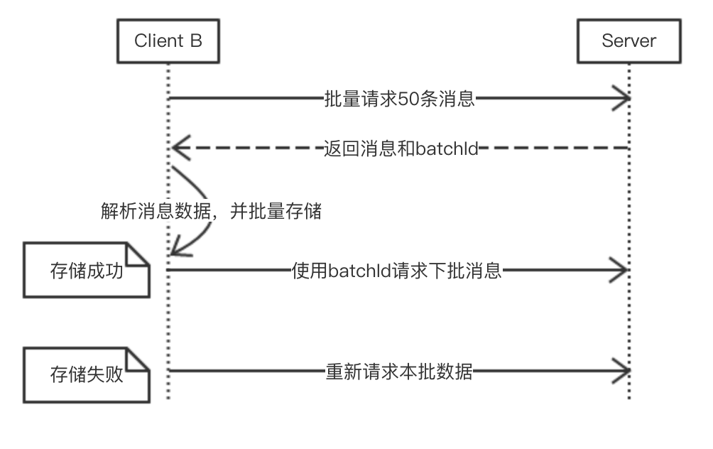
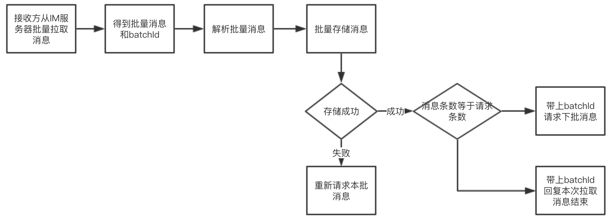

# 4 离线消息的处理
IM软件中，经常遇到接收方不在线的时候，发送方发送了大量消息。接收方上线后收到大量的离线消息。如果客户端处理不当，极容易造成UI卡顿。

首先，我们看一下对于发送方和接收方同时在线的情况，发送方发送一条消息给IM服务器，IM服务器将消息存储后回复ack给发送方，再将消息推送给接收方，接收方将消息存储起来，并回复ack给IM服务器。发送方和接收方同时在线时，由于用户手动输入加上两次网络传输耗时要比接收方写入数据库加上刷新UI的耗时多，这样处理并没有问题。

对比双方同时在线情况，离线情况下接收方重新上线后，如果服务器和在线情况下同样处理，接收方会收到大量消息，如果服务器推送消息的速度过快，接收方由于接收消息存储数据库、数据处理和UI刷新，很容易出现卡顿。因此，有必要对此种情况进行处理。

对于离线消息的处理，一般采用客户端批量拉取离线消息的方式。接收方客户端client B从服务器请求一批消息（如50条），服务器返回一批消息给接收方客户端，接收方客户端将消息批量存储，回复ack给服务端并刷新UI。如果批量存储有任意一条失败，则认为批量存储失败，重新请求本批消息。接收方客户端回复ack给服务端后，则继续发起请求请求下一批数据。这里可以做一个优化，将接收方存储本批数据的ack和请求下一批数据的ack合并成一个请求。
对应流程图如下：

