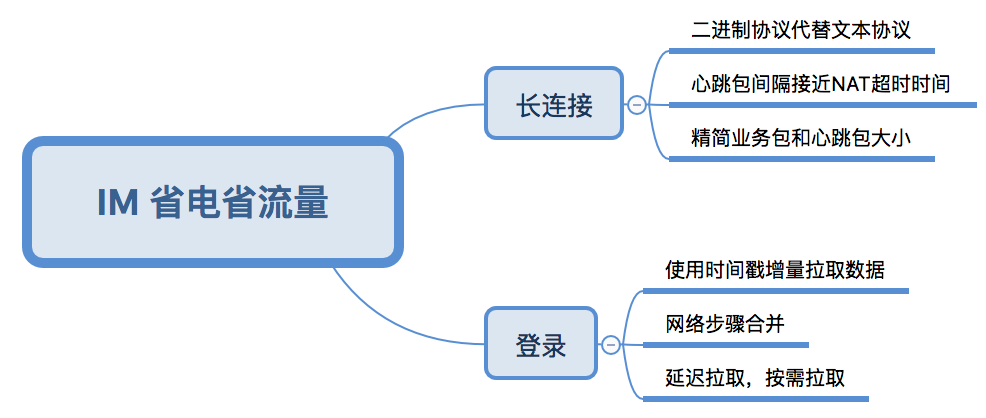

# 5 如何做到省电省流量
IM软件一方面因为登录时候数据量大，需要耗费大量流量和电量，数据不仅有在线消息（单对单聊天、群聊）、离线消息、文件、图片、视频，还有好友列表、群组列表、群友列表、好友详情、群组详情、群友详情等；另一方面因为IM软件要保证消息的及时性，需要在客户端维护一个长连接，长连接需要定时发送心跳包，本身也需要消耗流量和电量。因此有必须要对IM软件进行优化，做到尽可能省电省流量。

IM长连接方面主要的优化主要有以下几点：
1.  使用二进制协议（如Protobuffer）代替文本协议（XML、JSON）。关于Protobuffer与JSON、XML的对比，可以参考[这篇文章](https://developers.google.com/protocol-buffers/docs/overview)。
2.  心跳包发送间隔尽量接近NAT超时时间，如何使心跳包发送间隔接近NAT间隔，可以参考[一种Android端IM智能心跳算法的设计与实现探讨](http://www.52im.net/thread-783-1-1.html)。
3.  精简业务数据包和心跳包大小，比如将信令打平，使用int型数据代表信令接口名称。

IM登录时候主要的优化有以下几点：
1.  使用时间戳增量拉取数据，增量更新数据。
2.  延迟拉取数据，按需拉取数据。
3.  合并网络步骤。

下面使用一张图总结下IM优化流量电量要点

