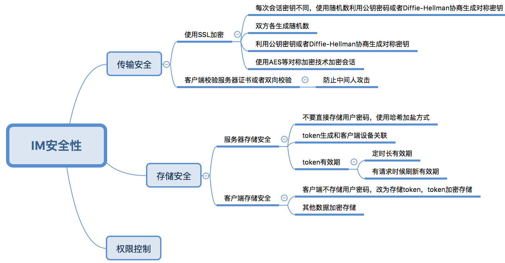

# 6 安全性
IM安全性主要包含传输安全、存储安全、权限控制等几个方面。

传输安全方面可以使用SSL加密、客户端校验服务端证书或者双向校验等方式。SSL本身利用了随机数、Diffie-Hellman或者公钥密码、对称密码等技术避免了绝大多数网络攻击，但无法防止中间人攻击。客户端校验服务器证书或者双向校验可以有效防止中间人攻击。

存储安全主要包含服务器存储安全和客户端存储安全。服务器存储安全要求服务器不要直接存储密码，改为[哈希加盐方式](http://blog.jobbole.com/61872/)，服务器生成token可以和设备关联起来 ，token有有效期或者在网络请求时候延长时间。客户端存储安全要求客户端不存储用户密码（即使加密存储也不行），改为加密存储token，对于其他数据也加密存储。

权限控制根据业务需要对不同用户进行不同的权限限制。

总结：

